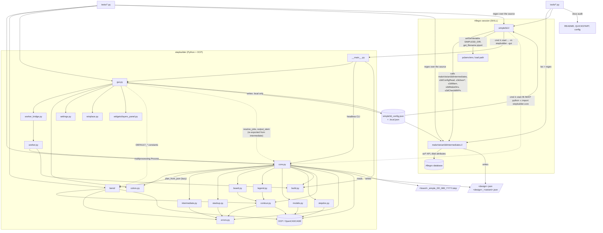

# Simple 3D — architecture: structure, function, and what is a monolith

Written 2026-09-02 (round 70) from a full read of every file in the repository:
both SKILL files, the six Python modules, all 22 test scripts, the tools and
probes, the shipped config, and the whole of `PROJECT_NOTES_simple3d.md`,
`README.md`, `QUICKSTART.md` and `CHANGELOG.md`. It describes the code **as it
is**, not as it should be; the plans for taking it apart are in
[REFACTORING_PLANS.md](REFACTORING_PLANS.md). The *reasons* behind most of the
decisions named here live in the round-by-round record, `PROJECT_NOTES_simple3d.md`;
this file points at them rather than repeating them.

Baseline on the day this was written: `tests/run_all.py` under Python 3.12 —
23/23 green in 277 s (the fold suite alone 176 s); the C++ geometry regression
reproduces 12073.309477 mm³ exactly. Step 0 of the plans was done the same day
(round 71): `tests/_support.py`, `tools/golden.py`, and the findings marked
fixed below.

---

## 1. The three pieces and the one boundary

```
Allegro PCB Editor (SKILL, one global namespace, loads once per session)
  simple3d.il                     menu item, install-folder resolution, ALWAYS_STEP_EXPORT,
                                  progress meter, Python pre-flight, GUI launch
  makeVariant3dIntermediates.il   loads skill/s3d_*.il - nine parts (round 77, D6):
                                  util, json, props, variants, geometry, stackup, bends,
                                  silk, export - which read the database and write
                                  <design>[_<variant>].json
        │
        │   the intermediate JSON  ("format": "simple3d", format_version 9)
        ▼
Python 3.10+ / cadquery-ocp  (package stepbuilder, runs OUTSIDE Allegro)
  __main__.py   entry: window / --gui prefilled window / headless CLI, one parser
  gui.py        the Tk window; reads+writes simple3d_config[.local].json
  worker.py     BuildSettings + run_jobs, in a child process
  core.py       the intermediate -> a STEP assembly (board, legend, components)
  bend/         folding a flex board along its bend areas (a package since round 72)
  colors.py     themes, ink colours, layer kinds
```

The JSON is the only contract between the halves, and everything the export
*decides* inside Allegro is written into it (layer polarity, silkscreen per
stackup, which symbols a variant installs). Everything the *build* decides is
decided on the Python side per Generate, with no re-export (body stitching,
silk layers on/off, soldermask in or out, folding, k factor). That split is
deliberate and load-bearing — see PROJECT_NOTES rounds 10b, 14 and 27.

Both halves read the same settings file pair: `simple3d_config.json` (tracked,
shipped defaults) with `simple3d_config.local.json` (gitignored, this
installation) merged over it key by key. SKILL reads `allegro`, `silkscreen`,
`settings`; Python reads `gui`. The window writes only the local file, and only
the keys that differ from the default.

---

## 2. Structural view

### 2.1 Files, sizes, responsibilities

| file | lines | procedures / defs | what it holds |
|---|---:|---:|---|
| `makeVariant3dIntermediates.il` | 83 | 2 | the loader (round 77, D6): finds its folder (`S3D_ExporterDir`, else where it was loaded from, else `SIMPLE3D_DIR`) and `load()`s the nine parts below in order |
| `skill/s3d_util.il` | 211 | 9 | console messages, folders beside the board, indentation, the subclass sweep |
| `skill/s3d_json.il` | 421 | 18 | `s3dJsonQuote`, the JSON reader, the config pair (shipped + local) |
| `skill/s3d_props.il` | 293 | 7 | `NO_STEP_EXPORT` / `ALWAYS_STEP_EXPORT`, embedded models, what has a STEP model |
| `skill/s3d_variants.il` | 475 | 7 | `Variants.lst` (the upstream parser), which symbols a variant exports |
| `skill/s3d_geometry.il` | 473 | 10 | segments, arcs, circles, slots, the board contour, pin holes |
| `skill/s3d_stackup.il` | 604 | 13 | board thickness, stackups, zones, per-layer shapes |
| `skill/s3d_bends.il` | 236 | 8 | bend lines and bend areas |
| `skill/s3d_silk.il` | 733 | 15 | the silkscreen: config, collection, clipping, the streamed writer |
| `skill/s3d_export.il` | 602 | 4 | `symbolReturn3DElements`, `makePcb`, the JSON writer, `makeVariant3dIntermediates` |
| `simple3d.il` | 908 | 17 | settings from config, install-folder resolution, loads `makeVariant3dIntermediates.il` when it has not been loaded (so one `load()` is enough), `pcb → cad` folder rule, `ALWAYS_STEP_EXPORT` dictionary entry + `open` trigger, Allegro progress meter, the export command, Python pre-flight, the launcher |
| `stepbuilder/core.py` | 719 | 12 | the build as a sequence: `_prepare_stackups` → `_Stack`, `_plan_fold`, `_build_board`, `_build_legend`, `_place_components`, then `generate()` (90 lines with its docstring) that calls them in order and writes; `BuildResult`, `total_board_thickness`; and the re-exports that keep every `core.<name>` a caller ever used |
| `stepbuilder/build.py` | 173 | 3 | `BuildOptions`: the nineteen options of one build as one frozen dataclass, with the meaning of each; `from_settings` (the window's snapshot) and `from_args` (the CLI). Round 73, plan A8 |
| `stepbuilder/stepdoc.py` | 89 | 6 | `StepDocument`: the XCAF app/doc, shape and colour tools, the root assembly, `set_name`, `set_color`, and `write(path, minimize_size)` with the one writer setting that halves the file, set after the writer is constructed. Round 73, plan A7 |
| `stepbuilder/models.py` | 359 | 14 | component models: `StepFileIndex` (an ordered search path over the model folders, case-folded as the last resort), `ModelCache` (each distinct STEP read once into the document; `labels_for` says "missing" or "unreadable" once per file), `component_transform`, `_report_embedded_only`, `_sanitize`. Round 73, plan A6 |
| `stepbuilder/legend.py` | 544 | 13 | the silkscreen legend: the arc conventions and `_pick_convention` (settled by the board's own areas), `_wire_from_vertices`, `_silk_face`, `build_silkscreen`, `_merge_coplanar`, `clip_silk_to_zones`, `DEFAULT_FLAT_HEIGHT` / `DEFAULT_SILK_THICKNESS`. Round 73, plan A5 |
| `stepbuilder/board.py` | 633 | 14 | the board body: `make_board_geometry` (a plain board and the zone paths), `layer_solids` (THE zones×layers walk: `_layer_region` turns a drawn shape into material or an opening, each layer extruded at its own height, cutouts per layer when asked), `make_board_layer_parts` + `fuse_keeping_faces` (the inspect and layer-coloured builds), `_stackup_board` + `fuse_and_unify`, `_zone_solid`, `board_cutouts` (repeats dropped), `has_solid`, `_rim_faces`. Round 73, plan A4 |
| `stepbuilder/stackup.py` | 223 | 8 | the stackup arithmetic, no OCC: `restack`, `drop_soldermask`, `align_stackups`, `stackup_levels`, `zone_levels`, the soldermask / conductor matchers. Round 73, plan A3 |
| `stepbuilder/reporting.py` | 29 | 2 | `LogFn`, `ProgressFn` and the two no-ops — every stage module needs them and none may import core for them. Round 73 |
| `stepbuilder/intermediate.py` | 277 | 18 | `Intermediate` (one parse: `is_simple3d`, `is_full_board`, `components`, `metadata`, `validate`, `silkscreen_layers`), `RESERVED`, `resolve_jobs` (+ the path-shaped `resolve_json_jobs`), `batch_jobs` (the whole-board rule, for the window and the CLI alike), the old probe names as thin wrappers, `output_stem` / `dated_output_name`. Rounds 72–73, plans A2, A10 |
| `stepbuilder/bend/__init__.py` | 86 | 0 | the module docstring (what a bend is and how the fold is built) and the re-exports that keep `from stepbuilder.bend import X` working - the public names, the `DEFAULT_*`, and the underscored ones the tests import; nothing is defined here |
| `stepbuilder/bend/constants.py` | 102 | 1 | `EPS`, `MIN_ANGLE`, `DEFAULT_*`, `LogFn` — each number with its reason; plan B7 brings the rest here |
| `stepbuilder/bend/info.py` | 187 | 9 | `IDX_BEND_TYPE_INFO` parser, `Bend`, `bend_from_dict`, `bends_from_json` |
| `stepbuilder/bend/regions.py` | 170 | 10 | `_Piece` (one `face_box`/`holds` for both), `_Region`, `_Strip`, `_slice_trsf`, the OCC plumbing (`_bbox`, `_extent`, `_is_empty`) |
| `stepbuilder/bend/pieces.py` | 314 | 9 | cutting the flat outline into the pieces that fold: `_cut_into_pieces`, `_piece_face` (the pinch repair), `_face_poly`, `_band_face`, `_polygon_face`, `_faces_of`, `_touching`, `_closest_point` |
| `stepbuilder/bend/cut.py` | 146 | 4 | cutting a shape down to one piece: `_cut_to_region` (every skippable boolean skipped), `_crosses`, the cutters `_slab` and `_plane_face` sized from the shape's own box |
| `stepbuilder/bend/strip_revolve.py` | 227 | 4 | the exact construction: `_revolve_strip` (a straight strip is its section revolved), `_spans_alike`, `_prism_of`, `PRISM_*` |
| `stepbuilder/bend/strip_wrap.py` | 485 | 13 | the general construction, in its parts since round 73 (B5): `_Frame` (the cylinder and the map into its parameter space), `_edge_curves` / `_sampled` (a flat edge as 2-D curves - a line stays a line, an arc becomes an ellipse, the rest a fitted spline), `_wire_on` (the outline as a wire on a surface, corners shared by topology), `_face_on` and `_walls`, `_sewn_solid` and `_expected_volume`; `_map_strip` is the sequence and keeps `give_up`'s first-reason rule; `MAP_VOLUME_TOLERANCE` |
| `stepbuilder/bend/plan.py` | 900 | 27 | `FoldPlan` and how it is built: `plan_fold`, `plan_from_json`, the chain, the k-ceiling, `_seam_gap`, `_double_claimed`, the anchor |
| `stepbuilder/bend/apply.py` | 179 | 2 | `apply_plan` — cut region by region, bend each strip (revolve, else wrap, else facets), fuse — and `_fuse_all` |
| `stepbuilder/contour.py` | 290 | 8 | a JSON contour as a wire (`build_contour`, `WIRE_TOLERANCE`) and as a flat polygon (`contour_points`, `polygon_area`, `clip_halfplane`, `point_in_polygon`, `point_on_polygon`); the arc convention lives here; `_face_from_wires` (wires → a planar face with holes, used by the board and the legend alike) since A4. Round 72, plan A1 |
| `stepbuilder/errors.py` | 13 | 1 | `StepBuilderError`, so that contour, bend and core raise one class without importing each other. Round 72 |
| `stepbuilder/gui.py` | 1184 | 59 | one `tk.Tk` subclass: widget layout, the hand-over between widgets and `settings.GuiSettings`, freeze/thaw, log colouring, the Tk-side reactions to a build (`_on_progress/_on_done/_on_error/_on_crash`), `set_theme`; placement through `winplace`, the layer list through `widgets.layers_panel`, the child process through `worker_bridge` |
| `stepbuilder/widgets/layers_panel.py` | 178 | 9 | `LayersPanel(ttk.LabelFrame)`: the scrolled Top/Bottom checkbox list - `refresh(found, layers_off)`, `current_layers_off`, `set_all` (live sides only), `update_sides`, wheel grab/release. Round 74, plan C4 |
| `stepbuilder/winplace.py` | 138 | 6 | window placement for any `tk.Tk`: the virtual desk, `geometry_is_reachable`, `parse_geometry`, centre / restore / the normal-geometry filter; no tkinter import. Round 74, plan C3 |
| `stepbuilder/settings.py` | 404 | 18 | the settings pair without a widget in sight: `merge_config` (the twin of SKILL's `s3dJsonMerge`), `read_config_file` (a problem is never an empty file), `local_config_path`; then the `gui` section as ONE table, `GUI_KEYS` (name, field, default, load, save), `GuiSettings`, `load_gui_settings` (both migrations live in the `load` of the key that superseded them) and `save_gui_settings` (only what differs from the shipped default). Round 72, plans C1–C2 |
| `stepbuilder/__main__.py` | 390 | 5 | one argparse parser (`build_parser`) for the headless CLI and the `--gui` window, `_open_window` with the crash log under `pythonw`; the build's options go through `BuildOptions.from_args` since A8. Round 74, plan C6 |
| `stepbuilder/worker.py` | 176 | 2 | frozen `BuildSettings`; `run_jobs` = resolve jobs, `intermediate.batch_jobs` for the full-board file, per-job isolation, progress slicing; the build's options go through `BuildOptions.from_settings` since A8 |
| `stepbuilder/worker_bridge.py` | 143 | 9 | `WorkerBridge`: the window's half of the child process - `start`, `drain_once` (queue to five callbacks), `check_alive` (a death is a crash unless `cancelled`), `cancel`, `close`; `crash_advice(code)` is the text. No tkinter. Round 74, plan C5 |
| `stepbuilder/colors.py` | 160 | 5 | Allegro's eight themes, cream rim, two inks, seven layer kinds + classifier |
| `tests/` (27 files) | ~5000 | — | 22 suites + `run_all.py` + `_support.py` + `fixtures/`; several suites are transliterations of SKILL procedures |
| `tools/` | ~1100 | — | five mechanical SKILL checks (`skill_checks.py` — parens, strings, calls, prog locals, undeclared assignments since round 76 — and `check_arity.py`), the docs audit, the Python name check (`python_names.py`, round 72), the golden corpus (`golden.py`, round 71), the SKILL exporter run headless and its own golden corpus (`skill_export.py`, round 75), a hand test that writes a property, 11 read-only Allegro probes |
| `simple3d_config.json` | 86 | — | four sections: `allegro`, `gui`, `silkscreen`, `settings`; `_comment_*` keys as documentation |

Counts for `core.py`, `bend/`, `contour.py`, `errors.py`, `intermediate.py`,
`gui.py`, `settings.py`, `stackup.py`, `reporting.py`, `board.py`, `legend.py`,
`models.py`, `stepdoc.py`, `build.py`, `worker.py`, `__main__.py`,
`winplace.py`, `widgets/layers_panel.py` and `worker_bridge.py` are as of round
74 (after plans A, B, C1–C5); the other rows are as of round 70. The defs column counts
every `def` and `class` line, nested ones included.

### 2.2 Dependencies



Two things the picture makes visible:

- **`core` and `bend` imported each other** until round 72, both lazily
  (inside functions): `core` needed `contour_points` / `point_in_polygon` for
  the legend clip and the silk centroid; `bend` needed `build_contour` and
  `StepBuilderError` to cut the outline with its real arcs. Plan A1 moved all
  of those into `contour.py`, and the exception into `errors.py`. The one edge
  left is `core → bend` for the fold plan; `import stepbuilder.bend` no longer
  loads `core`. Both modules re-export the moved names, so
  `core.build_contour`, `core.StepBuilderError` and
  `bend.contour_points` still resolve.
- **`simple3d.il` is not standalone.** It calls seven procedures and reads one
  global defined in the exporter file, so the documented load order is a
  hard dependency, not a convention.

### 2.3 Where data lives at run time

| what | where | written by | read by |
|---|---|---|---|
| shipped defaults | `<install>/simple3d_config.json` (tracked) | nobody at run time | both halves |
| this installation's settings | `<install>/simple3d_config.local.json` (gitignored) | the window, on close, only differing keys | both halves, merged over the defaults |
| where the tool is installed | Allegro variable `SIMPLE3D_DIR` in `pcbenv/env`, else the folder `simple3d.il` was loaded from | the user | `simple3d.il` (`s3dResolveScriptDir`) |
| the intermediate(s) | `<rev>/cad/` beside `<rev>/pcb/`, or beside the `.brd` | `create3dIntermediateFormat` | `core.generate`, `worker`, `gui` (layer list, full-board marker) |
| pre-flight log | `<cad>/_simple3d_preflight.txt`, deleted after reading | `s3dPreflight` | `s3dPreflight` |
| the STEP | `<cad>/<board>_simple_DD_MM_YYYY.step` (trailing `_` per collision) | `core.generate` | the user's CAD |
| GUI crash log | `<install>/simple3d_crash.log` | `__main__._open_window` under `pythonw` | the user |
| `ALWAYS_STEP_EXPORT` | the design's property dictionary (a change to the `.brd`) | `s3dEnsureAlwaysProp` on `open` and before every export | the exporter |
| per-session SKILL globals | `S3D_*` in the Allegro session | load time + each export | each export — see 4.1 |

---

## 3. Functional view — the pipeline

```mermaid
flowchart TD
    A([File → Export → Simple 3D]) --> B[s3dExportCommand<br/>resolve install folder, re-read allegro settings]
    B --> C{"real board open?<br/>axlGetDrawingName on disk"}
    C -- no --> C1[refuse, say so]
    C -- yes --> D[s3dEnsureAlwaysProp<br/>dictionary entry, cheap when present]
    D --> E[s3dResolveCadDir<br/>rev/pcb → rev/cad, else beside the .brd]
    E --> F[axlMeterCreate: progress form]
    F --> G[s3dCheckMfrPn<br/>components with no 3D model, by name]
    G --> H[makeVariant3dIntermediates cadDir]

    subgraph EXP["makeVariant3dIntermediates.il — one export"]
        H --> H1[make the export state<br/>shapes, bend lines, silk warnings, mech sequence]
        H1 --> H2[s3dBoardThickness<br/>the board's own stackup, by position]
        H2 --> H3[makePcbContour<br/>outline + CUTOUT shapes → primitives]
        H3 --> H4[s3dSilkConfig + s3dMakeSilkscreen<br/>collect per layer, clip to board, ONCE per design]
        H4 --> H5{"Variants.lst<br/>beside the .brd?"}
        H5 -- yes --> H6[gdsysGetVariantInfo → s3dVariantFit<br/>refuse a stub or a foreign file]
        H6 --> H7[per variant: s3dSymbolsToExport<br/>NO_STEP_EXPORT → list → ALWAYS_STEP_EXPORT]
        H7 --> H8[create3dIntermediateFormat]
        H6 --> H9[plus the whole board, if settings.exportFullBoard]
        H9 --> H8
        H5 -- no --> H10[s3dSymbolsToExport nil nil] --> H8
        H8 --> H8a[copy the cutout list, symbolReturn3DElements per symbol,<br/>symbolReturnPinHoles with s3dDrillXY]
        H8a --> H8b[header: embedded_models, stackups + per-layer shapes,<br/>zones, bends raw IDX_BEND_TYPE_INFO]
        H8b --> H8c[makePcb; strcat body; stream silkscreen; close; isFile check]
    end

    H8c --> I["s3dPreflight<br/>python -u -c import stepbuilder.core, tkinter — split sentinel"]
    I -- failed --> I1["console report + axlUIConfirm — the JSON is still there"]
    I -- ok --> J["s3dLaunch<br/>cmd /c start (empty title) /D install pythonw -m stepbuilder --gui …"]
    J --> K["axlMeterDestroy — the SKILL command ends"]

    subgraph PY["stepbuilder — the window and the build"]
        K --> L[__main__._open_window → StepBuilderApp<br/>load config pair, prefill json-dir/output/brd-name]
        L --> M[layer panel from the JSON: resolve_jobs, then<br/>Intermediate.silkscreen_layers per job - one parse each]
        M --> N([Generate])
        N --> O[_snapshot → frozen BuildSettings]
        O --> P[multiprocessing.Process: worker.run_jobs]
        P --> P1["resolve_jobs (parsed once) — drop the full-board file<br/>unless build_full_board or it is the only file"]
        P1 --> Q[core.generate per job]
        Q --> Q1[StepFileIndex over the model folders<br/>ordered, recursive, case-folded fallback]
        Q1 --> Q2[Intermediate.read unless one was handed in; validate]
        Q2 --> Q3["stackups: drop_soldermask if asked → align_stackups → stackup_levels<br/>or zone_levels for a v5 file — implicit zone on a plain board"]
        Q3 --> Q4["bend.plan_from_json → FoldPlan<br/>cut the outline into pieces, walk from the anchor, k ceiling, invariants"]
        Q4 --> Q5{board mode}
        Q5 -- solid, plain --> Q6[make_board_geometry: one prism − cutouts]
        Q5 -- solid, zones --> Q7[layer prisms → fuse_and_unify → cutouts]
        Q5 -- layers --> Q8[make_board_layer_parts → fold each → fuse_keeping_faces → colour per face]
        Q5 -- inspect --> Q9[make_board_layer_parts → fold each → one named part per layer]
        Q6 & Q7 & Q8 & Q9 --> R["rim faces in the flat frame — board colour"]
        R --> S["silkscreen: clip_silk_to_zones → layers off → build_silkscreen<br/>arc convention scored against the areas Allegro reported → fold piece by piece"]
        S --> T["components: read each model once, share the part,<br/>component_transform × fold.transform_at"]
        T --> U["STEPCAFControl_Writer, write.surfacecurve.mode"]
        U --> V([STEP file, BuildResult → queue → window log])
    end
```



### 3.1 Entry points

| entry | how | what it does |
|---|---|---|
| Allegro menu | `File → Export → Simple 3D` (`axlCmdRegister simple_3d_export`) | the whole pipeline above |
| Allegro `open` trigger | registered at load | defines `ALWAYS_STEP_EXPORT` in a real design |
| `python -m stepbuilder` | no arguments | the window, standalone |
| `python -m stepbuilder --gui …` | the launcher's form; `parse_known_args` | the window, prefilled |
| `python -m stepbuilder STEP_DIR JSON OUT [flags]` | headless; `--batch` for a folder | `core.generate` per file, exit 1 on any failure |
| `python tests/run_all.py [--quick]` | | the 4 checks + 22 suites as subprocesses |
| `python tools/skill_checks.py` / `check_arity.py` / `audit_docs.py` | | the mechanical checks, also run by `run_all` |
| `python tools/skill_export.py --record` / `--check` | Allegro | the SKILL exporter on every `input/*.brd`, headless (`allegro -nograph -s <abs .scr> <copy>`), recorded into `build/skill_golden/` and compared after every Plan D step - the golden corpus of the SKILL half (round 75). One board with `-o` |
| `load("…/tools/probes/probe_*.il")` | in Allegro, by hand | read-only diagnostics; `probe_variants.il` calls into the exporter |
| `load("…/tools/s3d_userprop_test.il")` | in Allegro, by hand | the one file that writes to a design |

### 3.2 The intermediate (format_version 9), as the reader sees it

```
{
  "format": "simple3d", "format_version": 9, "name": "<design>[_<variant>]",
  "full_board": true,                       optional, only ever true
  "embedded_models": ["X.step", …],          v4+
  "stackups": { "<name>": {                  v6+; "Primary" on a plain board
      "thickness": 1.104,
      "silkscreen": {"top": bool, "bottom": bool},   v8+
      "layers": [ {name, type, thickness, z_top, z_bottom, negative, function,
                   shapes: null | [ {outline:[prim…], voids:[[prim…]…]} ]} … ] } },
  "zones": [ {name, stackup, contour:[prim…]} … ],   v5+; [] on a plain board
  "bends": [ {name, line:{start,end}, inner_radius, width, info:"TYPE=…"} … ],   v7+
  "pcb": { "thickness": {soldermask_top, board, soldermask_bottom},
           "color": {r,g,b}, "edges": [ outline, cutout, cutout, … ] },
  "components": { "<refdes or NAME_MECHn>": { step_mapping:{step_name, rotation_xyz, offset_xyz},
                                               zone, is_mirrored, x, y, angle }, … },   v9; {} when none
  "silkscreen": { thickness, warnings:[…], top:[poly…], bottom:[poly…] }   v2+
}
```

`prim` is `{"type": "segment"|"arc"|"circle", …}`; a silk `poly` is
`{layer, area, vertices:[[x,y,r]…], holes:[…]}`. Two facts about this shape
matter structurally: until v8 **components shared the top level with the
metadata**, so `intermediate.RESERVED` names every metadata key and that is how
a v1–v8 file is still read (the SKILL writer carries a NOTE pointing at that
tuple); since v9 (round 79, E1) they sit under one `components` key, and
`Intermediate.components` takes either shape. Every version only ever *added*
an optional key, which is why a v2 file still builds - and v9 is the first a
reader older than it would misread, as one component called `components`.

---

## 4. State that outlives a call

### 4.1 SKILL globals (one Allegro session, files loaded once)

| global | set | reset per export? | consumers |
|---|---|---|---|
| `S3D_ScriptDir`, `S3D_LoadedFrom`, `S3D_ConfigFile` | load, `s3dResolveScriptDir` | re-resolved at each export | launcher, pre-flight |
| `S3D_Python`, `S3D_PythonW`, `S3D_CommandVisible`, `S3D_CommandName`, `S3D_DefineAlwaysProp` | `s3dLoadSettings` | re-read at each export | launcher, menu (label at load only) |
| `S3D_NoExportProp`, `S3D_AlwaysExportProp` | load | constants | symbol selection |
| ~~`S3D_MechSeq`~~ | — | — | since round 77 (D7) the export state's `'mechSeq`, reset per file by `create3dIntermediateFormat` |
| `S3D_CtrlChars` | first use (`'unset` → compiled or nil) | no, by design | `s3dJsonQuote` |
| `S3D_NegativeLayers`, `S3D_ExportFullBoard` | `s3dSilkConfig`, defaults restored first | yes (round 61) | layer polarity, the whole-board file |
| ~~`S3D_RigidFlexShapes`, `S3D_BendLines`~~ | — | — | since round 77 (D7) the export state's `'shapes` (per file) and `'bendLines` (per design), a table `makeVariant3dIntermediates` makes and hands down |
| ~~`S3D_SilkWarnings`~~ | — | — | since round 77 (D7) the export state's `'silkWarnings`, cleared by `s3dMakeSilkscreen` |
| `S3D_SilkDefaultTop/Bottom/Thickness`, `S3D_JsonNumChars` | load | constants | config fallback, JSON reader |

The accidental ones are gone since round 76 (D1–D2): several upstream
procedures used to assign names they never declared (`gdsysGetVariantInfo`:
`newLine`, `parts`, `subStrings`, `properties`, `temp`, `valueKey`, `line`, …;
`makeSlot`: `tmp`, `xStart`…; `makePcbContour`: `element`, `cutouts`;
`makePcb`: `pcbColor` — its caller's parameter name; `create3dIntermediateFormat`:
`placement`, `name`, `pcb`, `outFile`, `outPort`, `lines`). Under SKILL's
dynamic scoping these landed in the nearest enclosing binding or became session
globals; none was read afterwards, which is the only reason it was not a bug.
Every one is declared in its own `let` now, `makePcb` builds `colorJson`, and
`tools/skill_checks.py` check #5 reports any new one.

### 4.2 Python state

- Module constants that are captured as **default arguments** at import
  (`DEFAULT_SLICE_ANGLE` in `bend.plan_fold`, `DEFAULT_FLAT_HEIGHT` in the CLI)
  — patching the module at run time does not change them (round 40).
- `Interface_Static "write.surfacecurve.mode"` — an OCCT process global, set
  explicitly both ways after the writer is constructed.
- `StepBuilderApp` instance state: every setting as a Tk variable or plain
  attribute, `_layers_off`, `_frozen`/`_dimmed` (the pre-build widget states),
  `_bridge` (the `WorkerBridge`), `_paths_from_launcher`, the saved geometry.
- `BuildSettings` is the one frozen, picklable snapshot that crosses the
  process boundary; `core.generate` takes it apart into 22 keyword arguments.

---

## 5. Monolith, reusable, or glue

The classification asked for. **Monolith** = a unit carrying several
responsibilities that cannot be used or tested without the rest of it.
**Reusable** = usable as it stands from another program, or with a trivial
import change. **Glue** = small, project-specific plumbing that is right where
it is.

### 5.1 SKILL

| unit | lines | verdict | why |
|---|---:|---|---|
| `makeVariant3dIntermediates.il` as a file | 4048 in 9 parts | **was monolith (M5)** — split in round 77 (D6) | ten concerns in one load unit until then; now `skill/s3d_*.il`, one concern each (91 procedures), cut mechanically with every comment in place and the file itself a loader. Every part still shares the one SKILL namespace, so the `s3d` prefix discipline is what keeps them apart |
| `create3dIntermediateFormat` | 172 | monolith core | string assembly with hand-managed commas, per-export resets, file I/O and the `full_board` rule in one procedure |
| `makeVariant3dIntermediates` | 168 | orchestration | the variant loop; fine once the pieces are separable |
| `s3dJson*` reader, `s3dJsonMerge`, `s3dJsonQuote`, `s3dConfigRead`, `s3dLocalConfigFile` | ~400 | **reusable** | a self-contained JSON subset reader/merger/escaper for SKILL; nothing Allegro-specific |
| `s3dSay/Warn/Err`, `s3dMakeDirs`, `s3dDesignFolder`, `s3dVariantFilePath`, `s3dContains`, `s3dAddIndent` | ~120 | reusable | console + path utilities |
| `s3dObjectHasProp`, `s3dPropValue`, `s3dNoStepExport`, `s3dAlwaysStepExport`, `s3dEmbeddedModels`, `s3dHasStepModel`, `s3dIsMechanical` | ~200 | reusable | property and symbol probes; symbol names come back as symbols and these carry the coercion |
| `gdsysGetVariantInfo`, `s3dVariantFit`, `s3dVariantKnownRefdes`, `s3dIsRefdesToken`, `s3dSymbolsToExport` | ~380 | reusable | the `Variants.lst` parser and the export rule; the parser leaks a dozen globals |
| `makeLine/Arc/Circle/Slot`, `rotateXY`, `s3dDrillXY`, `boardGeometryParseSegment`, `s3dContourJson`, `makePcbContour`, `symbolReturnPinHoles` | ~420 | reusable, format-bound | geometry → the primitive vocabulary; the JSON shape is baked into the strings |
| `calculateBoardThickness`, `s3dLayerThk`, `s3dConductorSpan`, `s3dLayerIsNegative`, `s3dLayerInBody`, `s3dStackupJson`, `s3dStackupsJson`, `s3dZoneList`, `s3dZonesJson`, `s3dCollectRigidFlexShapes`, `s3dShapeJson`, `s3dLayerShapesJson` | ~560 | reusable readers, format-bound writers | the cross-section and zone readers are the only correct reading of `axlXSectionGet` on rigid-flex in this codebase (list order, not `position`) |
| `s3dBendsJson`, `s3dBendParts`, `s3dPathEnds`, `s3dSpanAcross`, `s3dBendAreaAt`, `s3dSweepBendLines` | ~210 | reusable readers | bends via the group; the sweep duplicates the visibility idiom |
| `s3dSilkConfig`, `s3dPolysFromDbid`, `s3dZeroWidth`, `s3dDescribeObject`, `s3dCollectSilkByLayer`, `s3dBoardPoly`, `s3dClipPolys`, `s3dClipGroups`, `s3dMakeSilkscreen` | ~600 | **reusable** | "every figure on these layers as filled polygons, clipped to the board" is useful far beyond STEP; already the model for the rigid-flex dump in a sibling repo |
| `s3dWriteVertexList`, `s3dWriteSilkPolys`, `s3dWriteSilkscreen`, `makePcb`, `symbolReturn3DElements` | ~260 | format-bound | the streaming writer half; the only place the silk JSON shape exists |
| `simple3d.il` | 897 | glue with two reusable pieces | `s3dResolveScriptDir`/`s3dFolderOf` (install-folder discovery with no path in source) and `s3dPreflight`/`s3dLaunch` (the cmd quoting rules, tested) are worth lifting; the rest is this menu item |

### 5.2 Python

| unit | lines | verdict | why |
|---|---:|---|---|
| `core.generate` | 90, was 646 | **was M1 — split in round 73 (A1–A9)** | the stages are functions of `core.py` taking `(data, stack, fold, options, document, …)` and returning what the next needs; the contour, the intermediate, the stackup arithmetic, the board, the legend, the models and the document are modules of their own. A9's split kept every segment's body verbatim; each stage unpacks the names it reads at its top |
| `core` contour + stackup arithmetic (`build_contour`, `restack`, `drop_soldermask`, `align_stackups`, `stackup_levels`, `zone_levels`, `_layer_region`, `make_board_layer_parts`, `_stackup_board`, `fuse_keeping_faces`, `fuse_and_unify`, `has_solid`, `board_cutouts`) | ~750 | reusable, with one duplication | pure functions over dicts and shapes; `make_board_layer_parts` and `_stackup_board` walk zones × layers twice |
| `core` silkscreen (`_arc_*`, `_wire_from_vertices`, `_face_from_wires`, `_silk_face`, `_pick_convention`, `build_silkscreen`, `_merge_coplanar`, `clip_silk_to_zones`) | ~520 | reusable | Allegro polygon vertex list → faces, with the convention search; independent of the board |
| `core.component_transform`, `StepFileIndex`, `_report_embedded_only` | ~250 | reusable | placement maths; an ordered, case-tolerant model index usable by any STEP-assembling tool |
| `intermediate.py` (`Intermediate`, `resolve_jobs`, the probe wrappers, `output_stem`, `dated_output_name`) | 252 | glue, reusable | one parse per file since round 72; the wrappers stay for a caller that holds a path |
| `core._rim_faces` | 65 | reusable | needs only a shape and an optional frame-back function |
| `bend.plan_fold` | 192, was 428 | **was M2 — split in round 72 (B6)** | the closures are module functions of `bend/plan.py` with explicit arguments — `_chain_at`, `_strips_overlap`, `_readable`, `_piece_at`, `_side_of`, `_walk`, `_neutral_ceiling` — and `plan_fold` is the sequence, with a 44-line docstring |
| `bend._map_strip` | 131, was 381 | **was M3 — split in round 73 (B5)** | `_Frame` (the cylinder and the map into its parameter space), `_edge_curves` / `_sampled`, `_wire_on`, `_face_on` / `_walls`, `_sewn_solid` / `_expected_volume` are functions of `bend/strip_wrap.py`; `_map_strip` is the sequence, and `give_up` with its first-reason rule stays in it |
| `bend` parsing (`parse_bend_info`, `info_length`, `info_number`, `Bend`, `bend_from_dict`, `bends_from_json`) | ~150 | reusable | the only reader of `IDX_BEND_TYPE_INFO` anywhere |
| `bend` 2-D helpers (`contour_points`, `polygon_area`, `clip_halfplane`, `point_on_polygon`, `point_in_polygon`) | ~125 | reusable | pure Python; also used by `core` |
| `bend` pieces (`_polygon_face`, `_band_face`, `_face_poly`, `_piece_face`, `_touching`, `_closest_point`, `_cut_into_pieces`, `_slab`, `_plane_face`) | ~330 | reusable | "cut a planar outline by strips and hand back valid pieces with their polygons"; carries the pinch repair and the sliver rule |
| `bend` strip constructions (`_spans_alike`, `_revolve_strip`, `_prism_of`) and `_fuse_all` | ~230 | reusable | exact revolve with the two prism tests |
| `_Region`, `_Strip`, `FoldPlan` | ~350 | data + apply | `face_box`/`holds` duplicated between the two dataclasses; `FoldPlan.apply` is the second-largest method |
| `gui.StepBuilderApp` | ~1300 | **monolith (M4)** | one class: layout, placement, the layer panel, the worker bridge, freeze/thaw, log. The two hand-written key lists became `settings.GUI_KEYS` in round 72 (C1–C2); what is left in the class is one `var.set` per field on load and one `var.get` per field on save |
| `gui._merge_config`, `_read_config_file`, `local_config_path` | ~60 | reusable | the settings-pair rule in Python |
| `gui` placement (`_virtual_screen`, `_geometry_is_reachable`, `_center_on_primary`, `_restore_geometry`, `_remember_geometry`) | ~95 | reusable | multi-monitor placement for any Tk window |
| `worker_bridge.py` (was the `gui` worker bridge: `_run_in_worker`, `_drain_queue`, `_drain_once`, `_check_worker_alive`, `on_cancel`) | ~150 | reusable | "build in a child process, survive an access violation, cancel" — already copied by hand into step2html; since round 74 (C5) a class with no tkinter in it, so the copy can become an import |
| `worker.py` | 204 | glue, reusable pattern | the batch rule lives here and only here (the CLI has no equivalent) |
| `__main__.py` | ~370 | glue | was two parsers for overlapping flags — since round 74 (C6) one `build_parser()` with a `--gui` mode, an unknown launcher flag an error; the `generate(...)` argument list used to appear here, in `worker._run` and in `gui._snapshot` — since round 73 (A8) it is `build.BuildOptions`, built once per caller |
| `colors.py` | 160 | reusable | as is |

### 5.3 Tests and tools

| unit | verdict | why |
|---|---|---|
| `tests/*.py` | 21 scripts, one shape | since round 71 every file imports `tests/_support.py` (the paths, `fails`, `check`, `rect`, `read_step`, `volume`, `bbox`, `count_solids`, `entity_count`) instead of its own copy; `run_all` still greps stdout (plan F3). Before that, `test_regression_geometry.py` printed MATCH/DRIFT and never set an exit code |
| SKILL transliterations in tests (`s3dJsonQuote`, `s3dDrillXY`, `s3dDesignFolder`, the variant rule, `tconc`, `s3dBendsJson`, the layer filter, the negative matcher, the merge) | valuable, scattered | they are the only executable specification of the SKILL side; worth collecting under one name |
| `tools/skill_checks.py`, `tools/check_arity.py` | reusable | a SKILL lexer and four checks; the lexer is duplicated between the two files |
| `tools/audit_docs.py` | glue | matches names, not claims (PROJECT_NOTES round 60) |
| `tools/python_names.py` | glue | pyflakes, kept to undefined names and redefinitions; exists because two moves in round 72 left a name behind and nothing but a name check could see it |
| `tools/probes/*.il` | record | read-only diagnostics; three attachment probes are a closed investigation kept as history |

---

## 6. Findings from the read (2026-09-02)

Defects and near-defects, with the place to look. None changes a build today;
each is a step in the plans.

| # | where | what |
|---|---|---|
| 1 | `tests/test_regression_geometry.py:396` | prints `MATCH`/`DRIFT`, exits 0 either way; `run_all` cannot see a drift. (It does match today: 12073.309477. The write statistics show 5038 entities where the memo records 5054; the test never checked entities.) **Fixed in round 71:** exits 1 on either drift; 5038 is right — the count moved at `687ea3f` (round 63) with the volume unchanged |
| 2 | `makeVariant3dIntermediates.il` (was 2319-2321, 2341, 3505, 3566, 3668) | refdes, `step_name`, zone name, silk layer name, warning text and the variant name were written into the JSON **without** `s3dJsonQuote`; a quote or backslash in a mapping table entry broke the whole file. **Fixed in round 76 (D4):** every string goes through `s3dJsonQuote`, `tests/test_emit.py` refuses a new raw site |
| 3 | `makeVariant3dIntermediates.il` (see 4.1) | undeclared locals in the upstream procedures leak as globals; `makePcb` rebinds its caller's `pcbColor`; `makeVariant3dIntermediates` declares `thicknesses` twice |
| 4 | `calculateBoardThickness` vs `s3dLayerInBody` | two rules for requirement #1: `pcb.thickness` gated on the `SOLDERMASK` name, the stackups on position + SILK/PASTE; a plain board with a mask named `SM_TOP` was one thickness in *Solid* and another in *Layers*. **Fixed in round 76 (D5):** `s3dBoardThickness` measures the board's own stackup by position; `calculateBoardThickness` remains only for a rigid-flex design with no `PRIMARY` |
| 5 | `core.py:395` | `_layer_region` re-imports `BRepAlgoAPI_Cut` locally though it is a module-level name — the `UnboundLocalError` trap `_rim_faces` documents, one added line away. **Fixed in round 71** |
| 6 | `worker.py:105` vs `__main__.py:304` | the "Build the full-board file too" rule exists only in the GUI batch; `--batch` always builds it. **Fixed in round 73 (A10):** the rule is `intermediate.batch_jobs`, the worker and the CLI's new `--no-full-board` both go through it |
| 7 | `core.py:1724-1784`, `gui.py:820` | `is_simple3d_json`, `is_full_board`, `silkscreen_layers` and `generate` each parse the whole file; on the 2.7 MB demo intermediate that is four parses per build and one per debounced keystroke. **Fixed in round 72 (A2):** `resolve_jobs` parses once and hands the `Intermediate` to `generate`; the window parses once per file per refresh |
| 8 | `core.py:2433` | the flat top-level namespace: every new metadata key must be added to `_reserved` — since round 72 `intermediate.RESERVED`, one place, the exporter's NOTE pointing at it; the namespace itself is Plan E |
| 9 | `README.md:58-59`, `CHANGELOG.md` (2026-07-27) | "Nothing temporary is written next to your board" — `s3dPreflight` writes and deletes `_simple3d_preflight.txt` in the cad/design folder |
| 10 | `.gitignore` | `input/` (57 MB of the user's real boards) was untracked but **not ignored**, one `git add -A` from the public remote; `failed/` is ignored with a comment saying why. Fixed in this round. |
| 11 | `colors.as_fraction` | defined, documented in the module docstring, never called. **Deleted in round 71** |
| 12 | `simple3d.il:591` | the export passes a hard-coded `list(0.0 0.4 0.0)` colour into every intermediate; the window overrides it from the theme |
| 13 | `.claude/launch.json` | points at the step2html repository's preview server. **Deleted in round 71** |
| 14 | `tools/audit_docs.py:56-57` | a `for … : pass` loop. **Deleted in round 71** |
| 15 | `demo/ap-214/demo.json` | carries no `"format": "simple3d"` marker (it predates the marker), so `resolve_jobs` ignores it: the window and the worker refuse the repository's own demo board; only `generate()` called directly — the tests and `tools/golden.py` — builds it. Found in round 72 while checking one-parse-per-file; not changed (the marker is Plan E's business, and adding it moves nothing in the geometry) |

Duplication worth naming (each is a step in a plan): the `generate()` argument
list ×3; the config key list ×2 in `gui.py`; the merge rule in two languages;
the visibility-snapshot idiom in the exporter and three probes; the zones ×
layers walk in `core`; `face_box`/`holds` in two dataclasses; the SKILL lexer in
two tools; the `check()` helper in nineteen tests.

---

## 7. What must not be "simplified" on the way

The load-bearing decisions are listed at the top of `PROJECT_NOTES_simple3d.md`
("READ THIS FIRST"). The ones a refactoring is most likely to trip over:

- fold **before** the fuse (rounds 36, 38); the layer-coloured build keys on the
  face objects the fuse hands back;
- do not fuse the solid legend, do union the flat one (10g, 12);
- volume through the iterative `VolumeProperties` overload (38);
- `has_solid` after every board boolean, `_is_empty` in `bend` (61);
- `wire_on` builds edges on shared vertices, not on a tolerance (41);
- the arc-convention search stays, with the known-right reading first (10d);
- `alpha`/`beta` bound an arc and `ccw` names the entry end (63);
- cutters sized **and placed** from the shape (63);
- per-export resets of every SKILL global that a config or a design fills (42, 61);
- loading the SKILL files does nothing but define and assign (54);
- settings: tracked defaults + local overrides, write only what differs, never
  write a file that was not understood at load and at save (12, 13, 58, 59).
